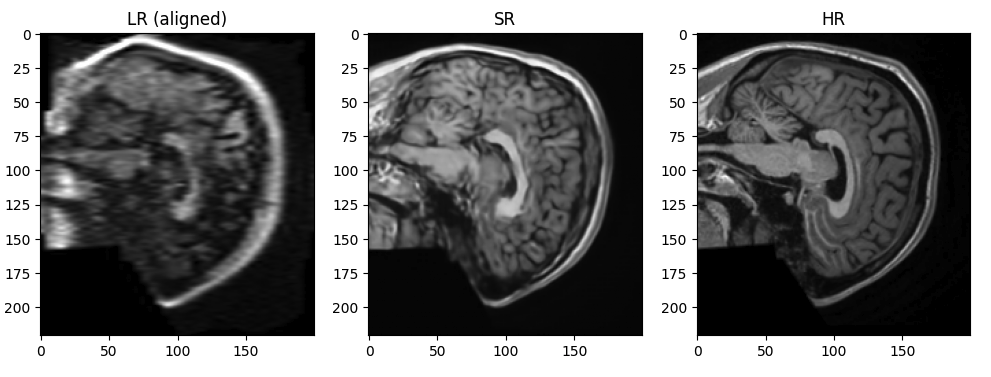

# Low-Field to High-Field MRI Enhancement using AMIR

Transformer-based medical image restoration for converting low-field (64
mT) MRI scans into high-field--like (3 T) images.

For more details, please see report.pdf

------------------------------------------------------------------------

## Overview

High-field MRI scanners (e.g., 3 T) produce high-resolution,
high-contrast brain images but are expensive and require specialized
infrastructure.\
Low-field MRI systems (e.g., 64 mT) are cheaper and more portable, but
suffer from:

-   Lower spatial resolution
-   Increased noise
-   Reduced tissue contrast

This project trains a **transformer-based restoration model** to map
low-field MRI slices to high-field quality images.

------------------------------------------------------------------------

## Model Architecture

We use the **AMIR (All-in-One Medical Image Restoration)** architecture:

-   Transformer-based encoder--decoder
-   U-shaped multi-scale structure
-   Task-adaptive routing modules
-   \~22.3M trainable parameters

------------------------------------------------------------------------

## Dataset

### Original dataset

-   18 paired low-field/high-field subjects (https://drive.google.com/drive/folders/1KkbUoFdgkOJXm8jFGLTEW39S6BO7AOzl?usp=drive_link)

### Augmented dataset

Using: - External IXI high-field MRI scans - Synthetic low-field
generation (https://pan.baidu.com/s/1oBBG_Stcn7cfO8U49S146w?pwd=3x13)

Final dataset: - \~200 paired subjects - \~35,800 sagittal slice pairs

### Data split

-   Training: majority of subjects
-   Validation: 2 original subjects
-   Test: 1 original subject

Splitting was performed at the **subject level** to avoid data leakage.

------------------------------------------------------------------------

## Preprocessing Pipeline

1.  Load NIfTI MRI volumes
2.  Resample low-field volumes to match high-field shape
3.  Percentile-based intensity normalization
4.  Extract sagittal 2D slices
5.  Generate synthetic low-field data:
    -   Downsampling
    -   Gaussian blur
    -   Intensity darkening
    -   Noise injection

------------------------------------------------------------------------

## Training Details

  Parameter              Value
  ---------------------- -------------------
  Architecture           AMIR
  Trainable parameters   \~22.25M
  Batch size             4
  Optimizer              Adam
  Learning rate          2e-4
  Loss                   L1 reconstruction
  Training duration      up to 60 epochs

------------------------------------------------------------------------

## Results

Evaluation was performed on a held-out test subject.

  Metric        Value
  ------------- --------------
  Mean PSNR     **18.64 dB**
  Median PSNR   15.75 dB
  Std Dev       7.76 dB
  Min PSNR      11.89 dB
  Max PSNR      43.13 dB

------------------------------------------------------------------------

## Qualitative Reconstruction

Low-field → Super-resolved → High-field

------------------------------------------------------------------------

## Repository Structure

    project/
    │
    ├── data_generator/
    │   ├── ixi_data_generator.ipynb/
    │   ├── synthetic_data_generator.ipynb/
    │
    ├── Models/
    │   └── CNN/
    |        ├── CNNUNet.ipynb
    |        ├── PhysicsCNN.ipynb
    |   └── TRANSFORMER/
    |        ├── AMIR_SYN.ipynb
    |
    └── README.md

------------------------------------------------------------------------

## Limitations

-   Training limited by compute (only 200 of \~450 available subjects
    used)
-   Model occasionally hallucinates structures
-   2D slice-based training reduces 3D anatomical consistency

------------------------------------------------------------------------

## Future Work

-   Train on full dataset with longer schedules
-   Use 3D or 2.5D inputs
-   Add SSIM or perceptual losses
-   Explore diffusion-based restoration models

------------------------------------------------------------------------

## Author

**Aritro Roy**\
NYU\
MS in Computer Science
